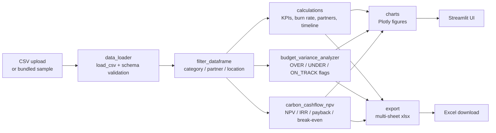

# NbS Financial Tracker

  

A Streamlit dashboard and Python toolkit for tracking Nature-based Solutions (NbS) project finances across an Indonesian carbon-credit portfolio. It turns a flat CSV of project budgets, disbursements, and spend into portfolio KPIs, partner payment schedules, variance flags, and NPV/IRR valuations — so program managers can spot over-budget work, slow disbursements, and under-performing carbon cashflows without leaving the browser.

## Features

- Portfolio KPIs: total budget, disbursed, spent, remaining, overall burn rate, disbursement rate, project count
- Budget vs actuals per project with `utilization_pct` and a > 90% burn-rate watchlist
- Partner payments: per-partner budget / disbursed / spent / pending disbursement, sorted by total budget
- Category summary: per-category totals and utilisation (Agroforestry, Forestry, Marine, Plantation, Restoration, Rewetting, Urban, Watershed)
- Monthly burn rate by category with cumulative disbursement timeline
- Budget Variance Analyzer with `OVER_BUDGET` / `UNDER_BUDGET` / `ON_TRACK` flags at project and category level (configurable tolerance)
- Carbon Cashflow NPV/IRR: NPV, IRR, discounted payback, break-even credit price per project + portfolio
- Multi-select filters on category, partner, and location
- Multi-sheet Excel export (KPIs, projects, partners, categories)
- CSV upload with schema validation, or bundled 25-project Indonesian sample

## Architecture



## Quick Start

```bash
git clone https://github.com/achmadnaufal/nbs-financial-tracker.git && cd nbs-financial-tracker
pip install -r requirements.txt
streamlit run app.py   # or: python3 -m demo.run_demo
```

## Usage

### CLI demo

```bash
python3 -m demo.run_demo
```

Actual captured output against the bundled 25-project portfolio:

```
======================================================================
NbS Financial Tracker — portfolio demo
======================================================================
  Projects in portfolio:               25
  Total budget:                $   3,161,000
  Total disbursed:             $   2,515,000
  Total spent:                 $   2,122,000
  Total remaining:             $   1,039,000
  Disbursement rate:                 79.6%
  Overall burn rate:                 67.1%

Spending by category:
    category  total_budget  total_spent  total_disbursed  project_count  utilization_pct
Agroforestry        231000       139000           170000              3               60
    Forestry        528000       360000           425000              4               68
      Marine        620000       390000           480000              4               63
  Plantation        263000       165000           205000              2               63
 Restoration        515000       340000           420000              4               66
   Rewetting        690000       520000           580000              4               75
       Urban        147000        98000           110000              2               67
   Watershed        167000       110000           125000              2               66

Top 5 partners by budget:
                   partner  total_budget  total_disbursed  total_spent  project_count  pending_disbursement
Yayasan Raja Ampat Lestari        250000           200000       165000              1                 50000
       Yayasan Karbon Biru        220000           180000       145000              1                 40000
    Komunitas Gambut Sehat        200000           180000       170000              1                 20000
     Yayasan Koridor Hijau        195000           160000       135000              1                 35000
       Yayasan Rawa Borneo        185000           150000       130000              1                 35000

Projects with utilisation > 90% (burn-rate watchlist):
  (none)

Run `streamlit run app.py` for the interactive dashboard.
```

### Python API — portfolio KPIs

```python
from src.data_loader import get_sample_data_path, load_csv, filter_dataframe
from src.calculations import compute_kpi_metrics, compute_partner_payments

df = load_csv(get_sample_data_path())
df = filter_dataframe(df, categories=["Restoration", "Rewetting"])

kpi = compute_kpi_metrics(df)
print(f"Burn rate: {kpi['overall_burn_rate']}%  |  Disbursed: {kpi['disbursement_rate']}%")
print(compute_partner_payments(df).head())
```

### Python API — budget variance

```python
import pandas as pd
from src.budget_variance_analyzer import (
    compute_project_variance,
    compute_category_variance,
    build_variance_report,
)

df = pd.read_csv("demo/sample_data.csv")
project_var = compute_project_variance(df, tolerance_pct=10.0)
cat_summaries = compute_category_variance(df, tolerance_pct=10.0)
report = build_variance_report(df, tolerance_pct=10.0)
```

Flags: `OVER_BUDGET` (variance > +tolerance), `UNDER_BUDGET` (< -tolerance), `ON_TRACK` (within band). Default tolerance 10%.

### Python API — carbon NPV / IRR

```python
import pandas as pd
from src.carbon_cashflow_npv import evaluate_project, evaluate_portfolio

metrics = evaluate_project(
    project_id="NBS-C01",
    capex_usd=500_000,
    opex_annual_usd=50_000,
    expected_credits_per_year=20_000,
    price_per_credit_usd=12.0,
    duration_years=10,
    discount_rate=0.08,
)

report = evaluate_portfolio(
    pd.read_csv("sample_data/sample_data.csv"),
    discount_rate=0.08,
)
```

## Tech Stack

| Layer         | Tool                        |
|---------------|-----------------------------|
| UI            | Streamlit >= 1.30           |
| Data          | pandas >= 2.1, NumPy        |
| Charts        | Plotly >= 5.18              |
| Export        | openpyxl >= 3.1             |
| Tests         | pytest >= 7.4 (110 tests)   |

## Project Structure

```
nbs-financial-tracker/
├── app.py                          # Streamlit application
├── src/
│   ├── data_loader.py              # CSV loading, validation, filtering
│   ├── calculations.py             # KPIs, burn rate, partner & timeline math
│   ├── budget_variance_analyzer.py # OVER / UNDER / ON_TRACK flags
│   ├── carbon_cashflow_npv.py      # NPV / IRR / payback / break-even
│   ├── charts.py                   # Plotly chart builders
│   └── export.py                   # Excel / CSV export utilities
├── demo/
│   ├── run_demo.py                 # CLI portfolio demo
│   └── sample_data.csv             # 25 Indonesian NbS projects
├── sample_data/sample_data.csv     # Carbon-project portfolio (NPV/IRR schema)
├── sample_data.csv                 # Root-level carbon-project sample (NPV/IRR schema)
├── tests/                          # 110 tests (loader, calc, variance, NPV, charts, export)
├── docs/
├── requirements.txt
├── LICENSE
└── README.md
```

## License

MIT — see [LICENSE](LICENSE).

> Built by [Achmad Naufal](https://github.com/achmadnaufal) | Lead Data Analyst | Power BI · SQL · Python · GIS
