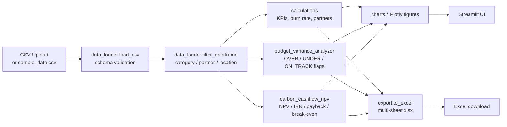

# NbS Financial Tracker


> Streamlit dashboard + Python toolkit for tracking Nature-based Solutions (NbS) project finances — budget allocation, disbursement timeline, partner payments, burn rate, variance analysis, and discounted cashflow valuation. Built around PUR's Indonesian portfolio workflow.

---

## ✨ Features

| Feature | Description |
|---|---|
| **Portfolio KPIs** | Total budget / disbursed / spent / remaining + burn-rate, disbursement-rate |
| **Budget vs Actuals** | Per-project utilisation % with watchlist for >90% projects |
| **Burn Rate** | Monthly spending trend by category, gauge chart for utilisation |
| **Partner Payments** | Per-partner disbursed vs pending, sorted by total budget |
| **Disbursement Timeline** | Cumulative disbursement area chart with category breakdown |
| **Budget Variance Analyzer** | Per-project + per-category variance with `OVER_BUDGET` / `UNDER_BUDGET` / `ON_TRACK` flags |
| **Carbon Cashflow NPV/IRR** | Project-level NPV, IRR, discounted payback, break-even credit price |
| **Filters** | Multi-select on category, partner, location |
| **Excel Export** | Multi-sheet workbook (KPIs, projects, partners, categories) |
| **CSV Upload** | Bring your own data or use the bundled sample |

---

## 🚀 Quick Start

```bash
git clone https://github.com/achmadnaufal/nbs-financial-tracker.git
cd nbs-financial-tracker
pip install -r requirements.txt

# Streamlit app
streamlit run app.py
# → http://localhost:8501

# Or CLI demo
python3 -m demo.run_demo
```

---

## 🧪 Usage

### Portfolio KPIs

```python
from src.data_loader import get_sample_data_path, load_csv, filter_dataframe
from src.calculations import compute_kpi_metrics, compute_partner_payments

df = load_csv(get_sample_data_path())
df = filter_dataframe(df, categories=["Restoration", "Rewetting"])

kpi = compute_kpi_metrics(df)
print(f"Burn rate: {kpi['overall_burn_rate']}%  |  Disbursed: {kpi['disbursement_rate']}%")
print(compute_partner_payments(df).head())
```

### Budget Variance Analyzer

```python
import pandas as pd
from src.budget_variance_analyzer import (
    compute_project_variance,
    compute_category_variance,
    build_variance_report,
)

df = pd.read_csv("demo/sample_data.csv")
project_var = compute_project_variance(df, tolerance_pct=10.0)
cat_summaries = compute_category_variance(df, tolerance_pct=10.0)
report = build_variance_report(df, tolerance_pct=10.0)
```

Flags: `OVER_BUDGET` (variance > +tol%), `UNDER_BUDGET` (< −tol%), `ON_TRACK` (within band). Default tolerance 10%.

### Carbon Cashflow NPV/IRR

```python
from src.carbon_cashflow_npv import evaluate_project, evaluate_portfolio, npv, irr

metrics = evaluate_project(
    project_id="NBS-C01",
    capex_usd=500_000,
    opex_annual_usd=50_000,
    expected_credits_per_year=20_000,
    price_per_credit_usd=12.0,
    duration_years=10,
    discount_rate=0.08,
)

import pandas as pd
report = evaluate_portfolio(pd.read_csv("sample_data/sample_data.csv"), discount_rate=0.08)
```

### Demo output

```text
$ python3 -m demo.run_demo
======================================================================
NbS Financial Tracker — portfolio demo
======================================================================
  Projects in portfolio:               25
  Total budget:                $   3,161,000
  Total disbursed:             $   2,515,000
  Total spent:                 $   2,122,000
  Total remaining:             $   1,039,000
  Disbursement rate:                 79.6%
  Overall burn rate:                 67.1%

Spending by category:
    category  total_budget  total_spent  total_disbursed  project_count  utilization_pct
Agroforestry        231000       139000           170000              3               60
    Forestry        528000       360000           425000              4               68
      Marine        620000       390000           480000              4               63
  Plantation        263000       165000           205000              2               63
 Restoration        515000       340000           420000              4               66
   Rewetting        690000       520000           580000              4               75
       Urban        147000        98000           110000              2               67
   Watershed        167000       110000           125000              2               66

Top 5 partners by budget:
                   partner  total_budget  total_disbursed  total_spent  ...
Yayasan Raja Ampat Lestari        250000           200000       165000  ...
       Yayasan Karbon Biru        220000           180000       145000  ...
    Komunitas Gambut Sehat        200000           180000       170000  ...
     Yayasan Koridor Hijau        195000           160000       135000  ...
       Yayasan Rawa Borneo        185000           150000       130000  ...
```

---

## 🏗 Architecture



---

## 🛠 Tech Stack

- **Streamlit** — dashboard UI
- **Pandas / NumPy** — data wrangling, NPV/IRR math
- **Plotly** — interactive charts
- **openpyxl** — multi-sheet Excel export
- **pytest** — 110-test suite

---

## 📁 Project Structure

```
nbs-financial-tracker/
├── app.py                          # Streamlit application
├── src/
│   ├── data_loader.py              # CSV loading, validation, filtering
│   ├── calculations.py             # KPIs, burn rate, partner & timeline math
│   ├── budget_variance_analyzer.py # OVER/UNDER/ON_TRACK flags
│   ├── carbon_cashflow_npv.py      # NPV / IRR / payback / break-even
│   ├── charts.py                   # Plotly chart builders
│   └── export.py                   # Excel/CSV export utilities
├── demo/
│   ├── run_demo.py                 # CLI demo
│   └── sample_data.csv             # 25 Indonesian NbS projects
├── sample_data/sample_data.csv     # Carbon-project portfolio sample
├── tests/                          # 110 tests (loader, calc, variance, NPV, charts, export)
├── docs/SCREENSHOTS.md
├── requirements.txt
└── LICENSE
```

---

## 📄 License

MIT License — see [LICENSE](LICENSE).

---

> Built by [Achmad Naufal](https://github.com/achmadnaufal) | Lead Data Analyst | Power BI · SQL · Python · GIS
